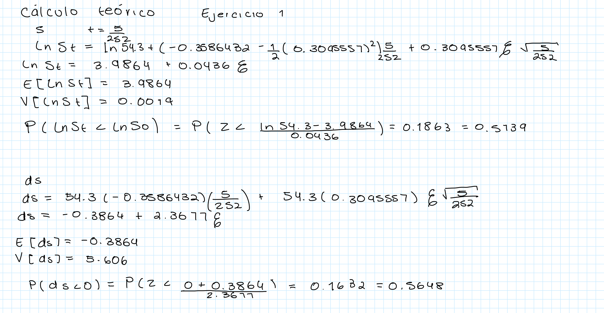
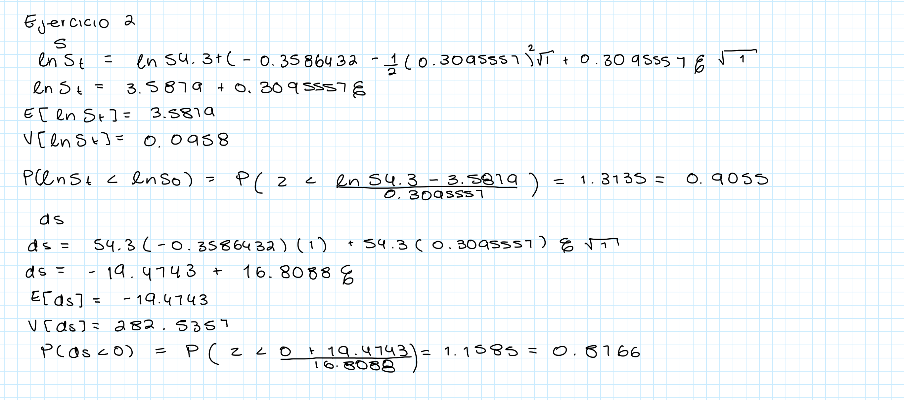
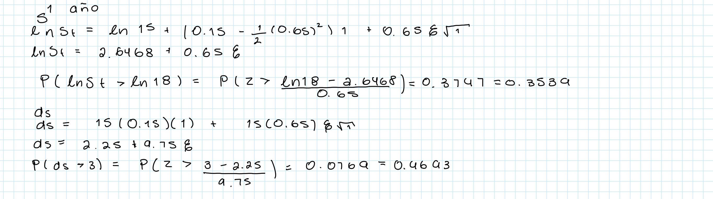
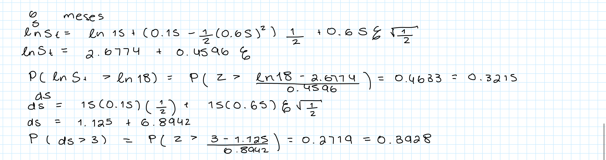
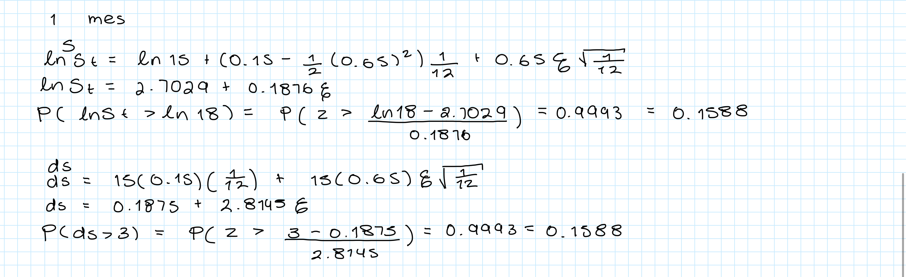

```{r}
library(quantmod)
library(lubridate)
clave <- "BIMBOA.MX"
datos <- new.env()
getSymbols(clave, from="2024-02-01", to="2025-02-01", env=datos)
precio <- datos[[clave]][,6]
plot(precio)
rendimiento <- na.omit(diff(log(precio)))
set.seed(123)
```

```{r}
mu <- mean(rendimiento)*252
sigma <- sd(rendimiento)*sqrt(252)
So <- as.numeric(tail(precio,1))
T <- 5/252
dt <- T/5 
t <- seq(0,T,length.out=6)

mu
sigma
So
```

# Ejercicio 1

## Simulación empirica de St a 5 dias

```{r}
sim <- 100000
p_final <- numeric(sim)

for(i in 1:sim){
  W <- c(0,cumsum(sqrt(dt)*rnorm(5)))
  St1 <- So*exp((mu-.5*sigma^2)*t+sigma*W)
  p_final[i] <- St1[6]
}
```

```{r}
mean(p_final<So)
```

## Simulación empirica de ds a 5 dias

```{r}
sim <- 100000
p_final <- numeric(sim)

for(i in 1:sim){
  W <- c(0,cumsum(sqrt(dt)*rnorm(5)))
  ds <- So*mu*t+So*sigma*W
  p_final[i] <- ds[6]
}
```

```{r}
mean(p_final<0)
```

## Ejercicio 1 teorico



## Comparacion de resultados

Al calcular que S sea negativo a 5 días de manera empirica obtenemos un resultado de 0.57251 mientras que al hacerlo de manera teorica obtenemos un resultado de 0.5739.

Al calcular que ds sea negativo o menor a cero en 5 días de manera empirica obtenemos como resultado 0.56492, al hacerlo de manera teorica obtenemos un resultado de 0.5648.

Notamos que ambos resutados al hacerlos de manera empirica y teorica nos dan bastante similares, tenemos una diferencia bastante pequeña que podria ser debida a los decimales usados o las simulaciones.

# Ejercicio 2

```{r}
mu <- mean(rendimiento)*252
sigma <- sd(rendimiento)*sqrt(252)
So <- as.numeric(tail(precio,1))
T <- 1
dt <- T/252 
t <- seq(0,T,length.out=252)

mu
sigma
So
```

## Simulacion empirica de St a 1 año

```{r}
sim <- 100000
p_final <- numeric(sim)

for(i in 1:sim){
  W <- c(0,cumsum(sqrt(dt)*rnorm(251)))
  St1 <- So*exp((mu-.5*sigma^2)*t+sigma*W)
  p_final[i] <- St1[252]
}
```

```{r}
mean(p_final<So)
```

## Simulacion empirica de ds a 1 año

```{r}
sim <- 100000
p_final <- numeric(sim)

for(i in 1:sim){
  W <- c(0,cumsum(sqrt(dt)*rnorm(251)))
  ds <- So*mu*t+So*sigma*W
  p_final[i] <- ds[252]
}
```

```{r}
mean(p_final<0)
```

## Ejercicio 2 teorico

{width="568"}

# Ejercicio 3

Probabilidad de el cambio en el precio sea negativo en 5 días utilizando St y ds:
  De Manera Empirica:
 St: 0.57251
 ds: 0.56492
 
  De Manera Teorica
 St: 0.5739
 ds: 0.5648
 
 Probabilidad de el cambio en el precio sea negativo en 1 año utilizando St y ds:
  De Manera Empirica:
 St: 0.90482
 ds: 0.87618
 
  De Manera Teorica
 St: 0.9055
 ds: 0.8766
 
 Podemos notar que al hacer la probabilidad de manera empirica y utilizando las ecuaciones de St y ds de manera teorica obtenemos resultados practicamente iguales la unica diferencia que notamos son unos cuantos decimales que se podrían deber a los decimales utilizados de manera teorica y de manera empirica por el numero de simulaciones.


# Ejercicio 4

## Simulación St y ds para 1 año

```{r}
mu <- 0.15
sigma <- 0.65
So <- 15
T <- 1
dt <- T/252 
t <- seq(0,T,length.out=252)

mu
sigma
So
```

```{r}
sim <- 100000
p_final <- numeric(sim)

for(i in 1:sim){
  W <- c(0,cumsum(sqrt(dt)*rnorm(251)))
  St1 <- So*exp((mu-.5*sigma^2)*t+sigma*W)
  p_final[i] <- St1[252]
}
```

```{r}
mean(p_final>18)
```

```{r}
sim <- 100000
p_final <- numeric(sim)

for(i in 1:sim){
  W <- c(0,cumsum(sqrt(dt)*rnorm(251)))
  ds <- So*mu*t+So*sigma*W
  p_final[i] <- ds[252]
}
```

```{r}
mean(p_final>3)
```

## Simulacion teorica de S y ds a 1 año



## Simulacion empirica St y ds a 6 meses

```{r}
T <- 126/252
dt <- T/126
t <- seq(0,T,length.out=127)
```

```{r}
sim <- 100000
p_final <- numeric(sim)

for(i in 1:sim){
  W <- c(0,cumsum(sqrt(dt)*rnorm(126)))
  St1 <- So*exp((mu-.5*sigma^2)*t+sigma*W)
  p_final[i] <- St1[127]
}
```

```{r}
mean(p_final>18)
```

```{r}
sim <- 100000
p_final <- numeric(sim)

for(i in 1:sim){
  W <- c(0,cumsum(sqrt(dt)*rnorm(126)))
  ds <- So*mu*t+So*sigma*W
  p_final[i] <- ds[127]
}
```

```{r}
mean(p_final>3)
```

## Simulacion teorica de S y ds a 6 meses



## Simulacion empirica de St yds a 1 mes

```{r}
T <- 20/252
dt <- T/20
t <- seq(0,T,length.out=21)
```

```{r}
sim <- 100000
p_final <- numeric(sim)

for(i in 1:sim){
  W <- c(0,cumsum(sqrt(dt)*rnorm(20)))
  St1 <- So*exp((mu-.5*sigma^2)*t+sigma*W)
  p_final[i] <- St1[21]
}
```

```{r}
mean(p_final>18)
```

```{r}
sim <- 100000
p_final <- numeric(sim)

for(i in 1:sim){
  W <- c(0,cumsum(sqrt(dt)*rnorm(20)))
  ds <- So*mu*t+So*sigma*W
  p_final[i] <- ds[21]
}
```

```{r}
mean(p_final>3)
```

## Simulación teorica de S y ds a 1 mes



# Ejercicio 5
```{r}
T <- 20
n <- 240
dt <- T/n
t <- seq(0, T, length.out = n + 1)

sim <- 100000
So <- 15
mu <- 0.15
sigma <- 0.65 

probabilidades <- numeric(n)

for (j in 1:n) {
  p_final <- numeric(sim)
  for (i in 1:sim) {
    W_final <- sum(sqrt(dt) * rnorm(j))
    St_final <- So * exp((mu - 0.5 * sigma^2) * t[j + 1] + sigma * W_final)
    p_final[i] <- St_final
  }
  probabilidades[j] <- mean(p_final > 18)
}

plot(1:n, probabilidades, type = "l", col = "blue", lwd = 2,
     xlab = "Tiempo (meses)", ylab = "Probabilidad de S_t > 18",
     main = "Evolución de la probabilidad en el tiempo")
grid()

```

```{r}
T <- 20 
n <- 240
dt <- T/n
t <- seq(0, T, length.out = n + 1)

sim <- 100000
So <- 15  
mu <- 0.15
sigma <- 0.65

probabilidades <- numeric(n)

for (j in 1:n) {
  W_final <- sqrt(j * dt) * rnorm(sim) 
  ds_final <- So * mu * t[j + 1] + So * sigma * W_final 
  probabilidades[j] <- mean(ds_final > 18)
}

plot(1:n, probabilidades, type = "l", col = "blue", lwd = 2,
     xlab = "Tiempo (meses)", ylab = "Probabilidad de S_t > 18",
     main = "Evolución de la probabilidad en el tiempo")
grid()

```

En la grafica de St podemos notar que la probabilidad a muy pocos meses incrementa demasiado, de ahi la grafica se podria decir que empieza a tener un poco de tendencia y empieza a bajar muy poco de mes a mes y la volatilidad de la probabilidad no es tan alta.

En cuanto a la grafica de ds podemos ver que a diferencia de la grafica la probabilidad va aumentando mes a mes y no empieza con un crecimiento tan grande como en la otra graica, a diferencia de la grafica de St donde en algun punto la probabilidad de que el precio sea mayor a 18 empieza a descender, la probabilidad de que el cambio en el precio de X sea mayor a 3 siempre va creciendo en este lapso de tiempo que se nos brindo.
